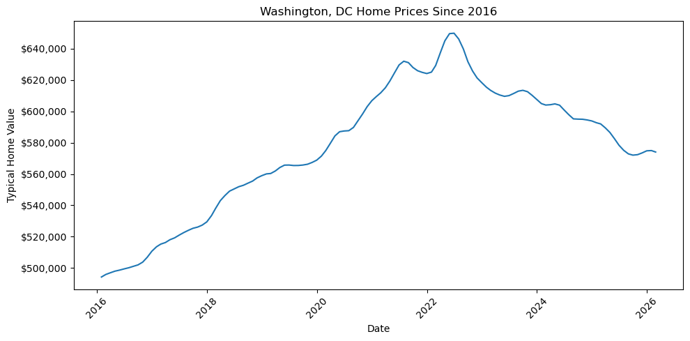
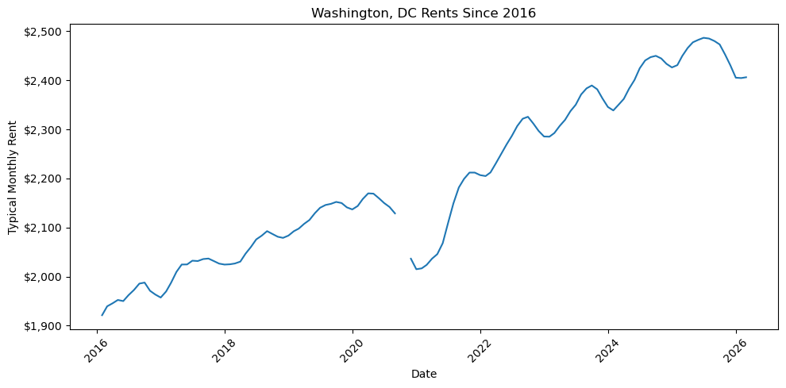

## The Question

For years, homeownership was treated as the default path to financial stability. But in high-cost markets, that assumption is harder to defend than it once was.

This project begins with Washington, DC, where home prices, rents, and borrowing costs have all shifted dramatically since 2016.

The central question is not just whether buying is better than renting, but where buying still makes sense as an investment.

## Why Start with DC?

Washington, DC is a useful case study because it combines many of the pressures shaping the modern housing market: high prices, strong demand, limited affordability, and a large population of renters.

For many households, DC represents the kind of market where buying may feel desirable, but not always financially realistic.

## How Home Prices Changed in Washington, DC

Since 2016, typical home values in Washington, DC have followed a clear upward trajectory, rising from just under $500,000 to a peak above $640,000 in 2022.

This increase accelerated significantly during the 2020–2022 period, when historically low interest rates and heightened housing demand pushed prices upward at a faster pace than in previous years. However, after reaching their peak, home values began to stabilize and slightly decline through 2023–2025.

This shift reflects a broader change in market conditions. As mortgage rates increased, borrowing became more expensive, reducing demand and slowing price growth. Even so, prices have remained elevated relative to pre-2020 levels, suggesting that affordability has not meaningfully improved despite the recent cooling.

## How Rents Changed in Washington, DC

Rents in Washington, DC also increased over time, but followed a different pattern than home prices.

From 2016 through early 2020, rents rose steadily, reflecting consistent demand in the rental market. However, a noticeable dip occurs around 2020–2021, likely due to pandemic-related disruptions, including reduced urban demand and temporary migration away from city centers.

After this decline, rents rebounded quickly and continued to rise through 2023 and 2024, reaching new highs near $2,500 per month. Unlike home prices, rents did not experience the same level of decline in recent years, indicating that rental demand has remained relatively strong.

## Why This Matters

The relationship between home prices and rents is critical for understanding housing affordability and investment potential.

While both have increased since 2016, home prices rose more sharply especially during the 2020–2022 period creating a growing gap between the cost of owning and the income a property can generate through rent.

This divergence has important implications:

- For residents, it makes homeownership less accessible relative to renting

- For investors, it reduces potential returns, since purchase prices are rising faster than rental income

In other words, even though the housing market has cooled slightly, the underlying economics of buying especially in a high-cost market like Washington, DC remain challenging.