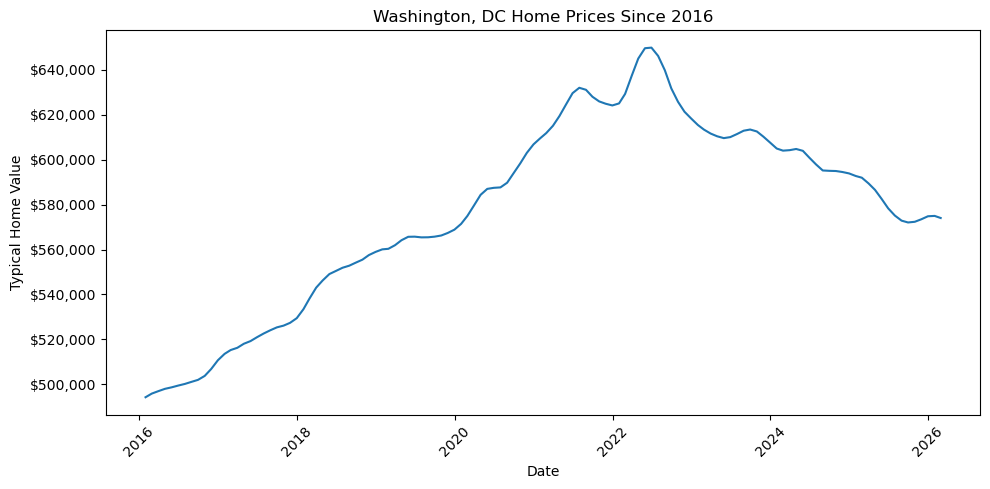
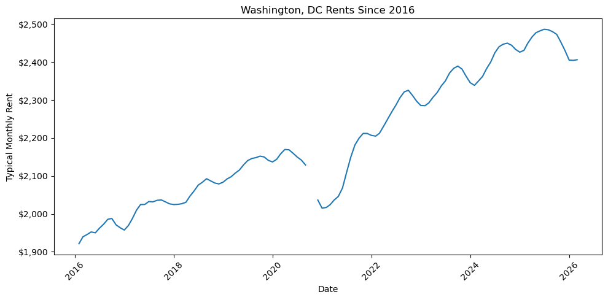
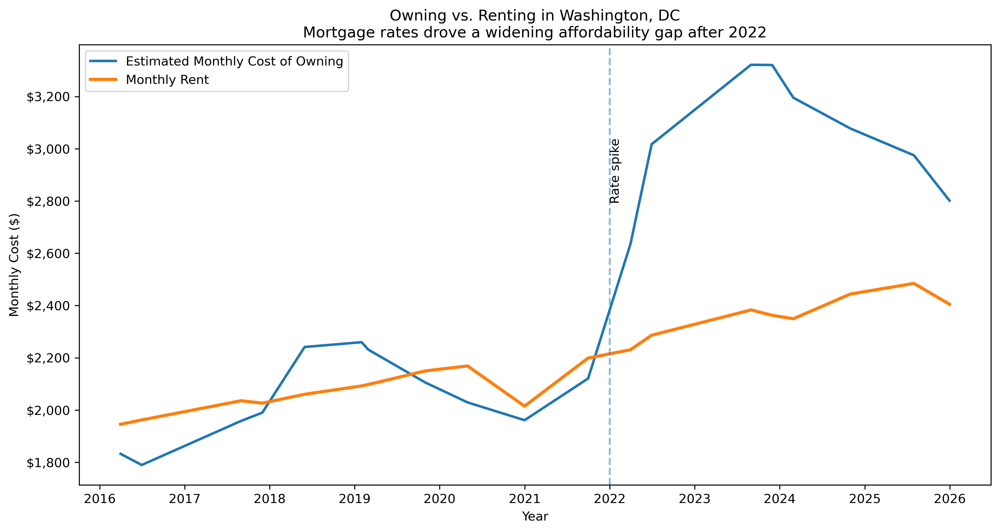
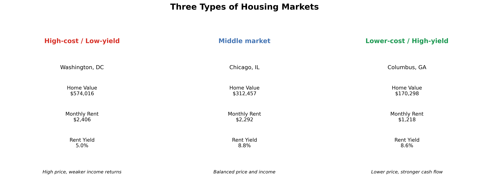

## The Question

For decades, homeownership has been treated as a reliable path to financial stability. Buying a home was not just a lifestyle choice, but a widely accepted way to build wealth over time.

But in today’s housing market, that assumption is no longer as clear as it once was.

In high-cost cities, rising home prices, changing rents, and higher borrowing costs have all reshaped the economics of buying. That raises a simple but increasingly important question:

**Is buying still worth it, and does the answer depend on where you live?**

---

## Why Washington, DC Is the Test Case

To answer that question, this project begins with Washington, DC.

DC is a useful place to start because it reflects many of the pressures shaping the modern housing market: high prices, strong demand, limited affordability, and a large renter population. It is a place where buying still carries social and financial appeal, but where that decision has become harder to justify on purely economic terms.

If the traditional promise of homeownership is breaking down anywhere, it is likely to be visible here.

---

## DC Got More Expensive, But Not in the Same Way for Buyers and Renters

Since 2016, home values in Washington, DC have followed a clear upward trajectory, rising from just under $500,000 to a peak above $640,000 in 2022.

This increase accelerated sharply during the 2020–2022 period, when low interest rates and heightened housing demand pushed prices upward at a much faster pace than in earlier years. Although prices have cooled slightly since then, they remain far above pre-2020 levels.



Rents also increased over time, but followed a different pattern.

From 2016 through early 2020, rents rose steadily. During the pandemic, rents dipped briefly as demand shifted away from dense urban areas. That decline was temporary. By 2023 and 2024, rents had rebounded and reached new highs near $2,500 per month.



At first glance, both charts tell the same story: housing in DC has become more expensive.

But the more important point is that prices and rents did **not** rise at the same pace.

---

## The Cost of Owning vs Renting

That difference matters because home prices alone do not determine whether buying is affordable. What households actually experience is the **monthly cost of owning**, and that cost depends not only on price, but also on mortgage rates.

Over the past several years, mortgage rates have risen sharply, especially after 2022. That change made borrowing much more expensive, even in a market where home prices had begun to stabilize.

As a result, the monthly cost of owning a home increased faster than home prices alone would suggest.



The chart above compares estimated monthly mortgage payments for a typical home in Washington, DC with average monthly rent.

In earlier years, the cost of owning and renting were relatively close. But as home prices increased and mortgage rates spiked, the cost of owning moved far above renting.

This helps explain why affordability has not meaningfully improved, even as the housing market has cooled.

For buyers, higher monthly payments make it harder to enter the market. For investors, higher financing costs further reduce the return a property can generate.

That leads to a broader question: if buying has become less attractive in DC, does it make more sense somewhere else?

---

## Where Buying Still Looks Stronger

Washington, DC is not representative of every housing market. To compare cities, I use **rent yield**, which measures annual rental income relative to home value.

Rent yield is useful because it captures the relationship between what a property costs and what it can earn. Higher rent yield generally signals stronger cash-flow potential, while lower rent yield suggests that purchase prices are high relative to rental income.

```{=html}
<iframe
  src="images/rent_yield_interactive.html"
  width="100%"
  height="650"
  style="border:none;">
</iframe>

The differences across cities are substantial.

I selected these cities to represent a range of housing markets, from expensive urban centers to more affordable secondary cities. I also have a personal connection to them, having lived in each of these places at different points in my life.

Washington, DC consistently falls on the lower end of the distribution, with rent yield typically around 4 to 5 percent. That suggests home prices are high relative to the income properties can generate.

In contrast, cities such as Augusta, GA and Columbus, GA show much higher rent yields, often in the range of 8 to 11 percent. These markets offer stronger cash-flow potential because home prices are lower relative to rents.

Cities like Chicago and Tacoma fall somewhere in between, representing more balanced markets where housing costs and rental income move more closely together.

## Where geography changes the story

The differences across housing markets are not just financial, they are geographic.

The map below makes that pattern easier to see. High-cost coastal and urban markets tend to cluster with lower rent yield, while more affordable cities in the Southeast and interior regions often show stronger income potential relative to price.

Geography helps explain why housing outcomes vary so widely. The same investment can behave very differently depending on where it is located.

<iframe src="images/housing_map.html" width="100%" height="700" style="border:none;"></iframe>

## A Broader Trend: Returns Are Getting Compressed

This pattern is not limited to one city.

Across nearly all markets in this analysis, rent yield declines over time, especially during the 2020–2022 period. That reflects a broader national trend in which home prices increased faster than rents.

Even in cities that still offer relatively high rent yield, this compression suggests that housing has become a less attractive investment from a purely income-driven perspective.

In high-cost markets like Washington, DC, that effect is especially visible.

## Price and Yield Across Cities

Rent yield shows which cities offer stronger rental return, but it becomes even more useful when paired with home prices.

The interactive chart below compares cities by typical home value and rent yield. Higher points represent stronger rental return relative to price, while points farther to the right represent more expensive housing markets.

<iframe
  src="images/price_vs_yield_interactive.html"
  width="100%"
  height="700"
  style="border:none;">
</iframe>

Together, these two dimensions make the tradeoff easier to see. Some cities are expensive but generate weak rental returns, while others offer lower purchase prices and stronger income potential.

That distinction helps explain why the answer to “Should you buy?” increasingly depends on where you are buying.

## Exploring Cities in Detail

Broad comparisons are useful, but they do not show how each housing market evolved over time.

The linked view below allows you to explore that history more directly. Click on any city in the comparison chart to see how home prices and rents changed over time.

<iframe
  src="images/linked_view.html"
  width="100%"
  height="700"
  style="border:none;">
</iframe>

This makes it easier to see why some markets now sit higher or lower on the rent-yield spectrum. In some cities, prices surged far faster than rents. In others, rents held up more strongly relative to home values.

## Why DC Stands Out

Washington, DC represents a particular kind of housing market: one where buyers pay a premium for location, stability, and long-term value. However, that premium comes at a cost.

Compared with the other cities in this analysis, DC consistently delivers lower rental returns relative to its price level. Buyers are effectively paying more for each dollar of rental income than they would in many lower-cost markets.

From an investment perspective, that makes DC less attractive for cash-flow-focused strategies, even if it still holds appeal for other reasons such as career access, amenities, or long-term appreciation.

## What This Means for Different Types of Buyers

The implications of these findings depend on the goals of the buyer.

For someone buying a home for personal use, factors like neighborhood, lifestyle, family stability, and long-term plans may matter more than short-term financial return. In that case, buying in a high-cost market may still make sense.

For investors, however, the calculation is different. Markets with higher rent yield offer stronger income potential and may produce better returns in the short to medium term. Lower-cost cities often provide more favorable conditions for generating cash flow.

The key shift is this:

**Homeownership is no longer a universally reliable path to financial return.**

Instead, it has become highly dependent on location.

In high-cost markets like Washington, DC, buyers often pay a premium for stability, access, and long-term appreciation, but receive relatively weak rental returns in exchange. In lower-cost markets, that tradeoff reverses: buyers give up some location advantages but gain stronger income potential.

The question is no longer simply whether buying is better than renting.  
It is whether buying in a specific market aligns with your financial goals.

## Three Types of Housing Markets

The graphic below summarizes three common market types that emerge from this analysis.



At one end are high-cost, low-yield markets like Washington, DC, where buyers pay more for stability and location than for income potential. In the middle are more balanced markets, where prices and rents move more closely together. At the other end are lower-cost, higher-yield cities, where properties may offer stronger cash flow even if they lack the prestige of larger coastal markets.

## Limitations

This analysis is intended to highlight broad patterns in housing markets, but several limitations should be considered when interpreting the results.

First, the data used in this project comes from Zillow’s aggregated home value and rent estimates. These reflect market averages rather than individual property characteristics, and may not capture local variation within cities.

Second, rent yield is a simplified measure of investment return. It does not account for important costs such as property taxes, maintenance, insurance, vacancy risk, or transaction costs. As a result, actual investment returns may differ from the values shown here.

Third, the estimates of monthly ownership costs are based on general assumptions about mortgage rates and financing conditions. Individual buyers may face different terms depending on credit, down payment, and timing.

Finally, this analysis focuses on financial outcomes and does not fully capture non-financial factors such as lifestyle preferences, job opportunities, or long-term personal goals, all of which play an important role in housing decisions.

These limitations mean that the results should be interpreted as directional insights rather than precise financial advice.

## Final Thoughts

Housing is no longer a uniform investment across locations.

In high-cost cities like Washington, DC, buyers often trade financial return for access, stability, and long-term appreciation. In lower-cost markets, buyers may give up some location advantages but gain stronger income potential.

The result is a fragmented housing landscape where outcomes vary sharply by geography.

What once functioned as a broadly reliable wealth-building strategy has become a set of tradeoffs. In some cities, buying still offers strong financial potential. In others, it requires accepting lower returns in exchange for stability, access, or long-term appreciation.

Understanding those tradeoffs is now essential.

The same decision, buying a home, can lead to very different outcomes depending on where it is made. The question is no longer simply whether to buy, but where to buy, and how that choice aligns with your financial goals and personal priorities.